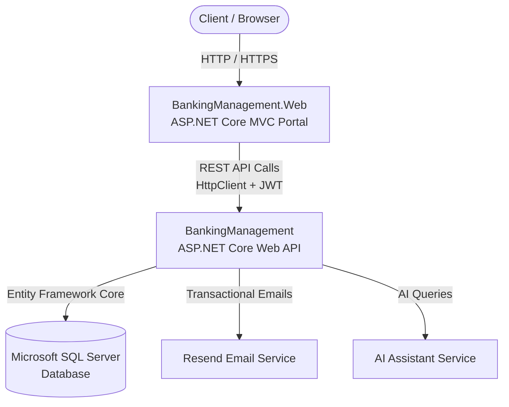

# Banking Management System 🏦

A modern, full-featured **Banking Management System** built with **ASP.NET Core (.NET 10)**, featuring a decoupled **Web API** backend, an interactive **ASP.NET Core MVC** web portal, automated **email transaction notifications** via Resend, AI-powered customer assistance, and real-time dashboard analytics.

---

## 📑 Table of Contents
- [Architecture Overview](#-architecture-overview)
- [Project Structure](#-project-structure)
- [Key Features](#-key-features)
- [Technology Stack](#-technology-stack)
- [Prerequisites](#-prerequisites)
- [Getting Started & Local Setup](#-getting-started--local-setup)
- [Configuration & Secret Management](#-configuration--secret-management)
- [Database Migrations](#-database-migrations)
- [API Endpoints](#-api-endpoints)
- [Screenshots & UI](#-screenshots--ui)
- [License](#-license)

---

## 🏛 Architecture Overview

The solution follows a clean, decoupled architecture:



- **`BankingManagement` (Backend Web API)**: Hosts business logic, database entities, Entity Framework Core data access, JWT authentication, transaction processing, and integration with third-party services (Resend for emails, AI chatbot).
- **`BankingManagement.Web` (Frontend MVC)**: Serves the responsive administrative and customer web interface using Razor views, Bootstrap 5, and JavaScript. Communicates with the backend API via `HttpClient`.

---

## 📂 Project Structure

```text
BankingManagement/
├── BankingManagement/                  # Backend REST API (.NET 10)
│   ├── Controllers/                    # API Endpoints (Auth, Account, Customer, Transaction, EmailLog, Dashboard, etc.)
│   ├── Data/                           # Entity Framework DbContext (AppDbContext)
│   ├── Dtos/                           # Data Transfer Objects for API requests/responses
│   ├── Migrations/                     # EF Core Code-First migrations
│   ├── Models/                         # Domain entities (Customer, Account, Transaction, EmailLog, AuditLog, etc.)
│   ├── Services/                       # Business logic services (EmailService, TransactionService, JwtTokenService, etc.)
│   ├── Program.cs                      # API pipeline & dependency injection configuration
│   └── appsettings.json                # API configuration (connection strings, JWT, Resend settings)
│
├── BankingManagement.Web/              # Web Frontend Portal (.NET 10 MVC)
│   ├── Controllers/                    # MVC Controllers (Auth, Account, Customer, Transaction, NotificationLog, Home, Chat)
│   ├── Models/                         # ViewModels and frontend DTOs
│   ├── Views/                          # Razor views styled with Bootstrap
│   │   ├── Account/                    # Account creation, listing, edit, and details
│   │   ├── Auth/                       # Login and registration views
│   │   ├── Customer/                   # Customer management views
│   │   ├── Home/                       # Modern dashboard with live KPIs and charts
│   │   ├── NotificationLog/            # Sent email & notification audit records
│   │   ├── Shared/                     # Navigation, layout, and common partials
│   │   └── Transaction/                # Deposit, withdrawal, and transfer interfaces
│   ├── wwwroot/                        # Static assets (CSS, JS, images)
│   ├── Program.cs                      # Web app pipeline configuration
│   └── appsettings.json                # Web app configuration (BaseUrl for Web API)
│
├── README.md                           # Project documentation
└── BankingManagement.sln               # Visual Studio Solution File
```

---

## ✨ Key Features

1. **Authentication & Authorization**
   - Secure customer and admin authentication with **JWT (JSON Web Tokens)**.
   - Salted and hashed password security.
   - Role-based authorization policies across API endpoints and Web views.

2. **Account & Customer Management**
   - Full CRUD operations for customer profiles and bank accounts.
   - Account status tracking (`Active`, `Suspended`, `Closed`).
   - Unique account numbering and customer association.

3. **Transaction Engine**
   - Seamless processing of **Deposits**, **Withdrawals**, and **Transfers**.
   - Balance checks, overdraft protection, and database transaction safety.
   - Complete audit trail with timestamps and reference numbers.

4. **Automated Email Notifications (Resend)**
   - Instant transactional email alerts delivered upon deposits, withdrawals, and transfers.
   - Persistent email delivery audit logs ([EmailLog](file:///c:/Users/HARSH%20RAI/source/repos/BankingManagement/BankingManagement/Models/EmailLog.cs)) with status tracking.
   - Dedicated **Notification Logs** UI in the web portal to review sent emails.

5. **Executive Analytics Dashboard**
   - Modern dashboard displaying key performance indicators:
     - Total Customers & Total Accounts
     - Total Deposits & Active Balances
     - Recent Transactions feed and monthly trends.

6. **AI Banking Assistant**
   - Integrated AI chat assistant accessible directly from the portal to answer banking questions and assist users.

---

## 🛠 Technology Stack

- **Framework**: .NET 10 (C#)
- **Web API**: ASP.NET Core Web API with OpenAPI / Swagger UI
- **Frontend**: ASP.NET Core MVC, Razor, HTML5, Vanilla CSS, Bootstrap 5
- **ORM**: Entity Framework Core 10 (Code-First)
- **Database**: Microsoft SQL Server / LocalDB / Express
- **Authentication**: JWT Bearer Tokens (`Microsoft.AspNetCore.Authentication.JwtBearer`)
- **Email Delivery**: Resend API integration
- **Version Control**: Git & GitHub

---

## 📋 Prerequisites

Before running the application locally, ensure you have:

- [.NET 10 SDK](https://dotnet.microsoft.com/download) installed
- [Microsoft SQL Server](https://www.microsoft.com/en-us/sql-server/sql-server-downloads) (or SQL Server Express / LocalDB)
- [Visual Studio 2022 / 2025](https://visualstudio.microsoft.com/) or [VS Code](https://code.visualstudio.com/) with C# Dev Kit
- A free [Resend API](https://resend.com) account (for email notifications)

---

## 🚀 Getting Started & Local Setup

### 1. Clone the Repository
```bash
git clone https://github.com/harshrai264/BankingManagement.API.git
cd BankingManagement.API
```

### 2. Configure Database & Secrets

#### A. Configure Database Connection
Open `BankingManagement/appsettings.json` and adjust the connection string for your local SQL Server instance:
```json
"ConnectionStrings": {
  "DefaultConnection": "Server=localhost;Database=Banking;Trusted_Connection=True;TrustServerCertificate=True;Encrypt=False;MultipleActiveResultSets=True"
}
```

#### B. Set Up Secrets via .NET User Secrets (Recommended)
To keep sensitive keys out of source control, store your local secrets in the .NET secret manager:
```bash
cd BankingManagement
dotnet user-secrets set "Jwt:Key" "YOUR_SUPER_SECRET_KEY_MINIMUM_32_CHARACTERS_LONG"
dotnet user-secrets set "Resend:ApiKey" "re_your_resend_api_key"
dotnet user-secrets set "Resend:FromEmail" "Banking Management <onboarding@resend.dev>"
cd ..
```

### 3. Apply Database Migrations
Apply the EF Core migrations to automatically create the database and tables:
```bash
dotnet ef database update --project BankingManagement
```

### 4. Run the Applications

Both the API and the Web frontend need to run concurrently:

#### Start the Web API:
```bash
dotnet run --project BankingManagement
```
> The API will start on `https://localhost:7112` (or the port defined in `launchSettings.json`).
> Access Swagger at: `https://localhost:7112/swagger`

#### Start the MVC Web Portal:
```bash
dotnet run --project BankingManagement.Web
```
> The web application will launch in your browser.

---

## ⚙️ Configuration Reference

### `BankingManagement/appsettings.json`
| Key | Description | Example / Default |
|---|---|---|
| `ConnectionStrings:DefaultConnection` | SQL Server database connection string | `Server=localhost;Database=Banking;...` |
| `Jwt:Key` | Symmetric secret key for signing JWTs (32+ chars) | Set via user-secrets or config |
| `Jwt:Issuer` | Valid JWT Issuer | `JwtIssuer` |
| `Jwt:Audience` | Valid JWT Audience | `jwtAudience` |
| `Resend:ApiKey` | API Key for Resend Email service | `re_...` |
| `Resend:FromEmail` | Sender display name and email | `Banking Management <onboarding@resend.dev>` |

### `BankingManagement.Web/appsettings.json`
| Key | Description | Example / Default |
|---|---|---|
| `ApiSettings:BaseUrl` | URL where the backend Web API is running | `https://localhost:7112/` |

---

## 📡 API Endpoints Overview

> 📖 **Full API Reference**: For exhaustive payload examples, request bodies, query params, and status codes, please see [API_DOCUMENTATION.md](file:///c:/Users/HARSH%20RAI/source/repos/BankingManagement/API_DOCUMENTATION.md).

| Category | Method | Route | Description |
|---|---|---|---|
| **Auth** | `POST` | `/api/User/CreateUser` | Register a new user/admin |
| | `POST` | `/api/User/Login` | Authenticate & get JWT Bearer token |
| **Customer** | `POST` | `/api/Customer/add` | Create customer(s) |
| | `GET` | `/api/Customer/GetAll` | Retrieve all customers |
| | `GET` | `/api/Customer/Get/{id}` | Retrieve customer profile by ID |
| | `PUT` | `/api/Customer/Update/{id}` | Update customer details |
| | `DELETE` | `/api/Customer/Delete/{id}` | Delete customer by ID |
| **Account** | `POST` | `/api/Account/add` | Open a new bank account |
| | `GET` | `/api/Account/GetAll` | Retrieve all accounts |
| | `GET` | `/api/Account/GetById/{accountId}` | Retrieve bank account details |
| | `PUT` | `/api/Account/Update/{accountId}` | Update account balance/status |
| **Transactions** | `POST` | `/api/Transaction/Deposit` | Deposit money & send email alert |
| | `POST` | `/api/Transaction/Withdraw` | Withdraw funds & send email alert |
| | `POST` | `/api/Transaction/Transfer` | Transfer funds & send email alert |
| | `GET` | `/api/Transaction/TransHistory/{accountId}` | View transaction statement |
| **Email Logs** | `GET` | `/api/EmailLog/GetAll` | Retrieve sent email logs |
| | `GET` | `/api/EmailLog/{id}` | Retrieve specific email log entry |
| **Dashboard** | `GET` | `/api/Dashboard/Stats` | Aggregate dashboard KPI metrics |
| **AI Assistant** | `POST` | `/api/Chat/Ask` | AI assistant inquiry |

---

## 🛡 Security Best Practices

- **Never commit production API keys or database passwords to Git.**
- In production, set secrets using Environment Variables, Azure Key Vault, or Docker secrets.
- Use HTTPS in all deployment environments.
- Enforce strict CORS policies in production within [Program.cs](file:///c:/Users/HARSH%20RAI/source/repos/BankingManagement/BankingManagement/Program.cs).

---

## 👨‍💻 Author & Contributing
- Developed by **Harsh Rai** ([@harshrai264](https://github.com/harshrai264))
- Contributions, issues, and feature requests are welcome! Feel free to check the issues tab.
